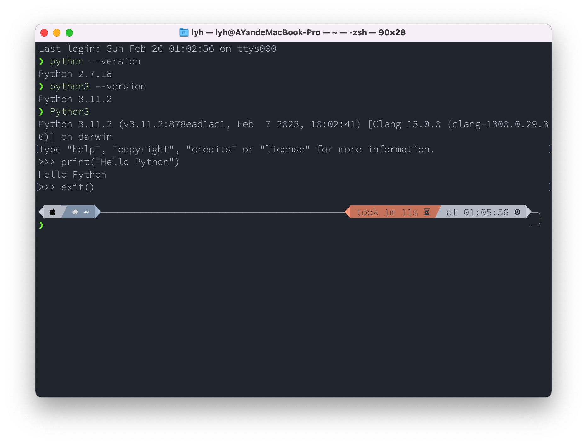

## 1.安装python

### 1.1.Windows

1. 访问 [Python官方下载页面](https://www.python.org/downloads/)，然后直接点击“Download Python 3.11.2”开始下载Python安装包：


2. 点击另存为，将Python安装包保存在电脑上，比如选择“桌面”：


3. 如果系统弹出如下提示，选择运行即可：

   


4. 注意：勾选“Add python.exe to PATH”，这项默认是不勾选的，然后点击“Install Now”，开始安装Python：

   

5. 点击“Disable path length limit”，然后点击右下角的“Close”：

   

### 1.2.Mac

1.访问 [Python官方下载页面](https://www.python.org/downloads/)，会自动识别为Download the latest version for macOS，直接点击“Download Python 3.11.2”开始下载Python安装包：

2.双击下载好的安装包运行

3.从介绍页签点击继续


4.弹出许可协议，点击同意

5.点击安装

6.点击关闭

7.您要将“Python”安装器移到废纸篓吗？点击保留。

8.检查Python 3.11.2是否安装完成，在Terminal中输入命令后按回车键
查看python解释器版本
`python3 --version`
查看python解释器版本并可以直接输入代码运行
`python3`
输入第一段代码
`print("Hello Python")`
退出python
`exit()`

其他安装方式:用Git安装
`brew install git python`


## 2.在终端中打开Python

打开Windows PowerShell，输入`py`，进入Python

```powershell
py
```


接着输入下面的内容，让Python在终端中“打印”出“Hello Python”：

``` python
print("Hello Python")
```


再试试下面的命令，“见识”一下一个错误的输入，Python的报错是什么样的，好像没什么可怕的

```python
print(Hello Python)
```


最后，我们输入下面的命令，退出Python终端，但仍然在PowerShell终端中，请注意观察区别：

```python
exit()
```


好了，后面就可以开始我们编程课的正式学习了。